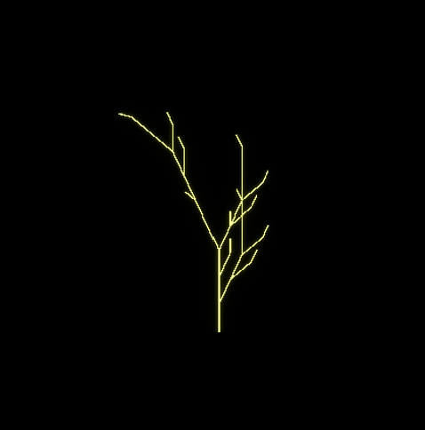
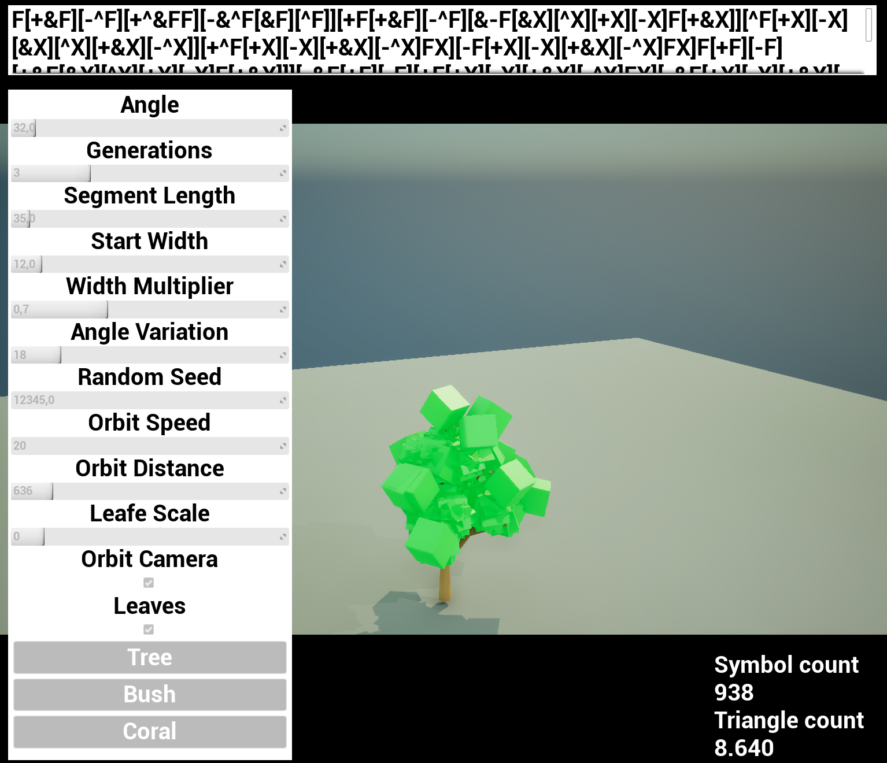
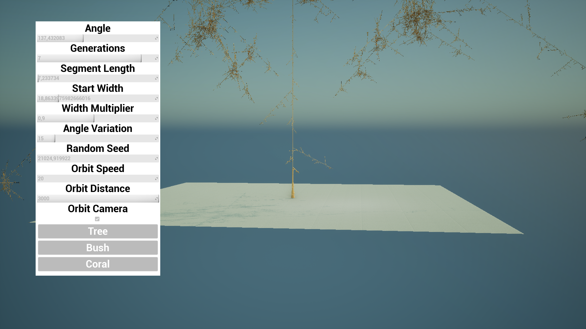

# Procedural Plant Generation with L-Systems in Unreal Engine 5

Author: Casper Van Laer  
Project type: Game AI research project  
Engine: Unreal Engine 5.8  
Language: C++ with Unreal Motion Graphics (UMG)

## Abstract

In this project, I researched how L-systems can create plant-like shapes in Unreal Engine. An L-system starts with a short group of letters. Rules replace these letters over several steps. The final list of letters is then read as drawing commands.

I first made a simple 2D version. This helped me learn how the rules, drawing commands, and branches work. After that, I made a 3D version with real mesh geometry. The final version has branches that become thinner, random rules, random angles, leaves, presets, camera controls, and a user interface. It also shows the full grammar, the number of symbols, and the triangle count.

## Research question

How can I use an L-system in Unreal Engine to create 2D and 3D plants that the user can change and recreate?

I split this question into four smaller questions:

1. How can I replace the letters of a grammar over several generations?
2. How can I turn the letters into drawing commands and branches?
3. Which Unreal rendering method works best for the 2D and 3D versions?
4. How can I add randomness while still being able to recreate the same plant?

## What is an L-system?

An L-system is a set of rules that changes a string of symbols. It was introduced by Aristid Lindenmayer. It has three main parts:

- An alphabet: all symbols the system can use.
- An axiom: the starting string.
- Rewrite rules: rules that replace one symbol with one or more symbols.

These rules can make a small starting string grow into a large pattern. This makes L-systems useful for creating plants and other repeating natural shapes [1].

The basic process in my project is:

```text
current string = axiom

repeat for the chosen number of generations:
    create an empty next string
    read every symbol in the current string
    replace the symbol if it has a rule
    otherwise, keep the symbol
    current string = next string
```

After all generations are finished, the program reads the symbols as commands. A virtual drawing cursor, often called a turtle, follows these commands. For example, `F` moves forward and draws, while `+` and `-` turn the turtle. The symbols `[` and `]` create branches by saving and loading the turtle's state. The Medium article in the reference list gave me a simple starting example of this method [2].

## How I made the project

### Step 1: Starting with a 2D version

I started in 2D so I could focus on the L-system itself. I did not yet need to think about 3D rotation, lighting, perspective, or building a mesh.

The starting axiom is:

```text
X
```

The first rules are:

```text
X -> F+[[X]-X]-F[-FX]+X
F -> FF
```

For every generation, the program reads the current string from left to right. If a symbol has a rule, it adds the replacement to a new string. Symbols without a rule stay the same. When the full string is done, the new string becomes the input for the next generation.

The 2D drawing commands are:

| Symbol | Action |
| --- | --- |
| `F` | Draw one piece and move forward |
| `+` | Turn right by the chosen angle |
| `-` | Turn left by the chosen angle |
| `[` | Save the current position and rotation |
| `]` | Load the last saved position and rotation |
| `X` | Help control how the string grows |

The `[` and `]` symbols are needed for branches. When the program finds `[`, it saves the turtle's position and rotation in a list. The turtle can then draw a side branch. When the program finds `]`, it loads the saved state and continues from the old point.



#### Drawing the 2D lines

Every 2D line uses the same mesh. Only its position, rotation, and size change. I used an Instanced Static Mesh Component, also called an ISM, to draw these pieces. Unreal's documentation says that an ISM can group copies of the same mesh. This can reduce draw calls and avoids making a separate object for every piece [3].

I used an orthographic camera to keep the view flat. I also used an unlit material, so the line colour does not depend on lights in the scene.

I made a small user interface with controls for the angle, generation count, and segment length. Changing a value creates the L-system again.

The main 2D files are:

- [`TwoDLSystem.h`](LSystems/Source/LSystems/2d/TwoDLSystem.h)
- [`TwoDLSystem.cpp`](LSystems/Source/LSystems/2d/TwoDLSystem.cpp)
- [`LSystemControlWidget.h`](LSystems/Source/LSystems/UI/LSystemControlWidget.h)
- [`LSystemControlWidget.cpp`](LSystems/Source/LSystems/UI/LSystemControlWidget.cpp)

### Step 2: Changing the system to 3D

After the 2D version worked, I made a new `AThreeDLSystem` class. I wanted the 3D branches to have different widths. Because of this, I did not use the same ISM method for the branches. I used an `UProceduralMeshComponent`, which lets the program build a mesh while the game is running.

For every `F`, the code makes a ring of points at the start of a branch and another ring at the end. It joins these rings with triangles to make a tube. The two rings can have different sizes, so the branch can become thinner. The code also adds normals, UVs, colours, and tangents. Unreal needs this mesh data to draw and light the surface correctly [4]. Each ring uses eight sides by default.

The 3D version uses more commands:

| Symbol | Action |
| --- | --- |
| `F` | Make a branch piece and move forward |
| `+` and `-` | Turn left or right |
| `&` and `^` | Turn up or down |
| `\` and `/` | Roll in either direction |
| `!` | Make the next branch thinner |
| `[` | Save position, rotation, and width |
| `]` | Load position, rotation, and width |
| `X` | Control growth and mark a possible leaf position |

I changed the camera from orthographic to perspective, which makes depth easier to see. The 3D branches and leaves use lit materials. The camera can stay still or move around the plant. The user can change both its speed and its distance from the plant.

The main 3D files are:

- [`ThreeDLSystem.h`](LSystems/Source/LSystems/3d/ThreeDLSystem.h)
- [`ThreeDLSystem.cpp`](LSystems/Source/LSystems/3d/ThreeDLSystem.cpp)

### Step 3: Adding random changes

The first L-system always created the same result. Real plants are not all exactly the same, so I added random rewrite choices. A symbol such as `F` or `X` can now have several possible replacements. Every replacement has a chance value.

I used Unreal's Random Stream system. It starts with a number called a seed. The same seed and settings create the same plant again. A different seed creates a different plant. This is useful for research because I can save a seed and test the same result more than once [5].

I also added angle variation. The change can be any value inside the allowed range. For example, with an angle of 25 degrees and a variation of 15 percent, a turn can be any value between 21.25 and 28.75 degrees. It does not only choose the lowest or highest value.

The project has three presets:

| Preset | Result | Leaves |
| --- | --- | --- |
| Tree | A taller shape with a main trunk | On |
| Bush | A wide shape with many branches | On |
| Coral | A spread-out shape without leaves | Off |

The 3D version starts with the Bush preset. Leaves are placed at `X` symbols that are still left after rewriting. The leaf mesh, material, size, and rotation can be changed. Leaves use an ISM because they are copies of the same mesh.

### Step 4: Adding the controls and information

The 3D user interface can change:

- angle;
- generations;
- segment length;
- starting width;
- width multiplier;
- angle variation;
- random seed;
- leaves;
- camera movement, speed, and distance;
- Tree, Bush, and Coral presets.

I made the layout in a Widget Blueprint. The C++ widget connects the controls to the `AThreeDLSystem` actor. When the user changes an important value, the plant is made again.

After the plant is ready, the L-system sends an `OnRegenerated` event. The widget then updates:

- the full generated grammar;
- the number of symbols;
- the number of triangles in the branches and leaves.

This means the interface only updates when something changes. It does not check the values on every frame. Unreal's UMG guide recommends this event-based method for values that only change at certain times [6].

The main UI files are:

- [`ThreeDLSystemControlWidget.h`](LSystems/Source/LSystems/UI/ThreeDLSystemControlWidget.h)
- [`ThreeDLSystemControlWidget.cpp`](LSystems/Source/LSystems/UI/ThreeDLSystemControlWidget.cpp)

## Code I am proud of

The code I am most proud of is the branch creation in `AddBranchSegment`. In the 2D version, I placed copies of an existing mesh. In the 3D version, this function makes every branch from points and triangles while the game is running.

This part finds the direction of the branch and makes two rings of points. One ring is at the start and one is at the end. Different ring sizes make the branch become thinner:

```cpp
const FVector Axis = End - Start;
const float Length = Axis.Length();
if (Length <= KINDA_SMALL_NUMBER)
{
    return;
}

const int32 SideCount = FMath::Max(BranchSides, 3);
const FVector Direction = Axis / Length;
const FMatrix Basis = FRotationMatrix::MakeFromX(Direction);
const FVector Right = Basis.GetUnitAxis(EAxis::Y);
const FVector Up = Basis.GetUnitAxis(EAxis::Z);
const int32 FirstVertexIndex = Vertices.Num();

for (int32 SideIndex = 0; SideIndex < SideCount; ++SideIndex)
{
    const float AngleRadians =
        2.0f * PI * static_cast<float>(SideIndex) /
        static_cast<float>(SideCount);

    const FVector RadialDirection =
        Right * FMath::Cos(AngleRadians) +
        Up * FMath::Sin(AngleRadians);

    Vertices.Add(Start + RadialDirection * StartRadius);
    Vertices.Add(End + RadialDirection * EndRadius);
    Normals.Add(RadialDirection);
    Normals.Add(RadialDirection);
}
```

The next part joins the two rings. Every side is made from two triangles:

```cpp
for (int32 SideIndex = 0; SideIndex < SideCount; ++SideIndex)
{
    const int32 Current = FirstVertexIndex + SideIndex * 2;
    const int32 Next =
        FirstVertexIndex + ((SideIndex + 1) % SideCount) * 2;

    const int32 StartCurrent = Current;
    const int32 EndCurrent = Current + 1;
    const int32 StartNext = Next;
    const int32 EndNext = Next + 1;

    Triangles.Add(StartCurrent);
    Triangles.Add(EndCurrent);
    Triangles.Add(StartNext);

    Triangles.Add(StartNext);
    Triangles.Add(EndCurrent);
    Triangles.Add(EndNext);
}
```

The `%` operation joins the last side back to the first side. This closes the branch shape.

I chose this code because it shows the biggest step from 2D to 3D. I kept the same L-system idea, but changed simple line pieces into my own 3D branches. It also allowed me to control the width and make smaller branches thinner.

The complete function is in [`ThreeDLSystem.cpp`](LSystems/Source/LSystems/3d/ThreeDLSystem.cpp).

## Final result



The final program can make a plant and change it while the game is running. A seed can recreate a random plant. The interface also shows the link between the letter string and the final mesh.

In the image above, the grammar has 938 symbols and the model has 8,640 triangles. These numbers only belong to the settings shown in the image. They are not a full performance test.

## Testing the settings

I used the controls to see what each setting changed.

| Setting | What it changes | Possible problem |
| --- | --- | --- |
| Generations | Adds more rewriting steps and branches | The string can become very large |
| Angle | Changes how far branches spread | Large angles can make the plant very wide |
| Segment length | Changes the length of each branch piece | The plant can move outside the camera view |
| Start width | Changes the size of the first branch | A very thick branch can hide small parts |
| Width multiplier | Changes how quickly branches become thinner | A value near one keeps branches thick |
| Angle variation | Makes turns less even | A high value can hide the main pattern |
| Random seed | Creates another repeatable result | The seed must be saved for a fair comparison |
| Branch sides | Makes a branch look more or less round | More sides create more triangles |

The image below shows a test with very large settings.



This test showed that generations and world size are different problems. More generations create more symbols and branches. Segment length and angle change how far those branches travel. Moving the camera farther away can show more of the plant, but it does not make the grammar or mesh smaller.

## Difference between the 2D and 3D versions

| Part | 2D version | 3D version |
| --- | --- | --- |
| Main goal | Test the rules and branches | Make a full plant model |
| Drawing | Copies of one mesh with ISM | A new branch mesh and ISM leaves |
| Camera | Orthographic | Perspective with optional movement |
| Material | Unlit | Lit |
| Turns | Left and right | Left, right, up, down, and roll |
| Width | Mostly the same | Becomes thinner along branches |
| Rules | Always the same | Several choices with chances |
| Random results | Not needed | Can be recreated with a seed |
| Shown information | The final drawing | Grammar, symbol count, and triangle count |

## Project files

```text
gameai-research-project-CasperVanLaerHowest/
|-- README.md
|-- pics/
|   |-- Begin.png
|   |-- FinalProduct.png
|   `-- WeirdGen.png
`-- LSystems/
    |-- LSystems.uproject
    |-- Config/
    |-- Content/
    `-- Source/LSystems/
        |-- 2d/
        |   |-- TwoDLSystem.h
        |   `-- TwoDLSystem.cpp
        |-- 3d/
        |   |-- ThreeDLSystem.h
        |   `-- ThreeDLSystem.cpp
        `-- UI/
            |-- LSystemControlWidget.h/.cpp
            `-- ThreeDLSystemControlWidget.h/.cpp
```

## How to run the project

1. Install Unreal Engine 5.8 and Visual Studio with C++ support.
2. Open [`LSystems.uproject`](LSystems/LSystems.uproject).
3. Let Unreal rebuild the C++ code if it asks.
4. Open `Map2D` for the first version or `Map3D` for the final version.
5. Check that the map contains the L-system actor, camera, Game Mode, and UI widget.
6. Add the branch and leaf meshes or materials in the actor settings if they are empty.
7. Start Play in Editor and change the values in the interface.

The project uses Unreal's Procedural Mesh Component plugin. Epic marks this component as experimental, so this should be considered before using it in a finished commercial game [7].

## What I learned

The project answered my research question in several steps:

- The 2D version proved that my rewriting rules and saved branch states worked.
- Keeping the grammar and drawing code separate made it easier to reuse the system in 3D.
- ISM worked well for many copies of the same 2D line or leaf mesh.
- The procedural mesh gave me control over branch shape and width.
- Random rules and angle changes made the plants look less even.
- Random seeds let me create the same result again.
- Presets and live controls let me compare results without rebuilding the code.
- The grammar, symbol count, and triangle count show how a larger string creates more geometry.

My tests mainly checked whether the features worked and how the plants looked. I did not make a full speed test or user study.

## Limits of the project

- The strings can grow very quickly. There is no final limit for the number of symbols or triangles.
- Each branch piece is its own tube section. The places where branches meet are not joined into one smooth surface.
- The open ends of branch pieces do not have caps.
- The turtle stores its rotation with Unreal's `FRotator`. Quaternions or separate forward, up, and right directions could make difficult 3D turns work better.
- The leaf triangle count uses the first detail level of the leaf mesh. It does not measure frame rate or GPU work.
- Very large settings can make the plant move outside the camera view.
- Epic describes the Procedural Mesh Component as experimental [7].

## Ideas for future work

1. Use quaternions to improve 3D turning.
2. Stop generation when the symbol, branch, point, or triangle count becomes too large.
3. Save generation time, mesh time, frame time, symbol count, and triangle count to a CSV file.
4. Compare procedural meshes, spline meshes, and instanced branch pieces.
5. Join branch pieces more smoothly and close their open ends.
6. Add flowers, fruit, or more leaf types.
7. Store rewrite rules in an Unreal Data Asset, so new presets do not need new C++ code.
8. Save and load all plant settings, including the seed.

## Conclusion

Starting in 2D helped me learn the main parts of an L-system before working with 3D meshes. The 2D version added the axiom, rewrite steps, movement commands, and saved branch states. The 3D version reused these parts and added more directions, branch width, custom geometry, random choices, leaves, and controls.

The main lesson is that the grammar and the drawing method can stay separate. The grammar describes the plant with symbols. The turtle turns those symbols into movement. The renderer turns that movement into lines or a 3D mesh. Because these parts are separate, I could improve the project one step at a time instead of building the whole 3D system at once.

## References

[1] P. Prusinkiewicz and A. Lindenmayer, *The Algorithmic Beauty of Plants*. Springer-Verlag, 1990. Available at: [Algorithmic Botany](https://algorithmicbotany.org/papers/abop/abop.pdf). Accessed 1 August 2026.

[2] Gianni, "Procedural Generation with L-Systems (very simple example)," Medium, 29 April 2022. Available at: [Medium](https://gkteco.medium.com/procedural-generation-with-l-systems-very-simple-example-4a21df1423c3). Accessed 1 August 2026.

[3] Epic Games, "Instanced Static Mesh Component," Unreal Engine 5.8 Documentation. Available at: [Epic Games documentation](https://dev.epicgames.com/documentation/unreal-engine/instanced-static-mesh-component-in-unreal-engine). Accessed 1 August 2026.

[4] Epic Games, "Create Mesh Section," Unreal Engine Documentation. Available at: [Epic Games documentation](https://dev.epicgames.com/documentation/unreal-engine/BlueprintAPI/Components/ProceduralMesh/CreateMeshSection). Accessed 1 August 2026.

[5] Epic Games, "Random Streams," Unreal Engine Documentation. Available at: [Epic Games documentation](https://dev.epicgames.com/documentation/unreal-engine/random-streams-in-unreal-engine). Accessed 1 August 2026.

[6] Epic Games, "UMG Best Practices," Unreal Engine Documentation. Available at: [Epic Games documentation](https://dev.epicgames.com/documentation/unreal-engine/umg-best-practices-in-unreal-engine). Accessed 1 August 2026.

[7] Epic Games, "ProceduralMeshComponent," Unreal Engine 5.8 C++ API Reference. Available at: [Epic Games documentation](https://dev.epicgames.com/documentation/unreal-engine/API/Plugins/ProceduralMeshComponent). Accessed 1 August 2026.
